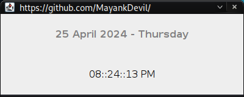

# JavaTodayGUI

- Name : "JavaTodayGUI"

- Description : "Java Graphic User Interface Clock program display system date day or time"

- Version : main

- Update : 25-04-2024

- Status : COMPLETE

- Responsive : False

- TechStack : { Java }

- Thanks : { GitHub | VSCodium | Java }

- Collabrate : { Self }

- Clone : https://github.com/MayankDevil/JavaTodayGUI.git

- Download : https://github.com/MayankDevil/JavaTodayGUI/archive/refs/heads/main.zip

#### Project Look & Feel



#### Theme

_" Default white theme by System "_

#### Key Feature that make program more valuble

- [x] Plathform Independent
- [x] GUI application
- [x] Clock Functionlity Perfomed
- [ ] Responsive

#### Requirement to use

-  Donwload

   <https://github.com/MayankDevil/JavaLoginGUI/archive/refs/heads/main.zip>
   
-  Install JRE
   
-  Get open Terminal in project folder

-  Change directiry into source folder

```sh

cd ./src/

```

-  Interpret bytecode

```sh
java App.class
```

- For close use CTRL+C else GUI


### Warning

** Copyright (C) by Mayank. All Right Reserved **

__" Please refrain from unauthorized coping or downloading of content, as such actions are subject to legal consequences and potential charges.We encourage respectful and responsible use of the resouces provided for learning purpose."__

[](https://github.com/MayankDevil/)


